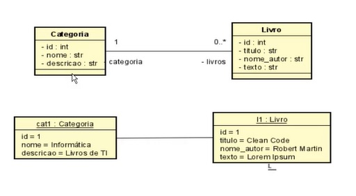

<div align="center">
  <h1>API Livraria</h1>
  <p>
	  API desenvolvida  para demonstrar um sistema de Livraria🤿 ☕ <br>
	  Desenvolvido com 💙 por Jefferson Cesar de Souza.<br>
	  Como Portifólio no meu Git
  </p>
</div>

## ⚙️ Funcionalidades 

- GET 
	

- POST 

- PATCH 
		
- DELETE

## 🛠️ Tecnologias utilizadas

- Java 17
- Spring Boot Web, Spring Web
>> Banco de dados MySQL-Produção e H2-Testes 

- O Front será feito em Antular 11


## 🖥️ Diagramas UML

Diagrama de Classes



#### Consulta Categoria com id=1     /categoria/1

````
{
	"id": 1,
	"nome": "Informática",
	"descricao": "Livros de TI",
	"livros": [
			{
				"id": 1,
				"titulo": "Microsserviços",
				"nomeAutor": "Susan J. Fowler",
				"texto": "Construindo sistemas padronizados em uma organização de engenharia de Softwares"
			},
			{
				"id": 3,
				"titulo": "Java",
				"nomeAutor": "Pedro Silveira",
				"texto": "Conheça as novidades do Java 8 e as novas versões do Java"
			}
	]
}

````

#### Consulta com id não encontrado

````
	{
		"timestamp": 1659762666474,
		"status": 404,
		"message": "Objeto não encontrada Id=5, Tipo: br.com.jeffe.livraria.domain.Categoria"
	}

````


## 📒 Conteúdos  

**BackEnd**: [Consumir API](https://github.com/JeffeDev)

**FrontEnd**: Front Angular 11  - Spring Web


## 🎯 O que o projeto faz:
  - [X] CRUD 


## 📸 Screenshots
####  📌 Back-End e Front-End 
aplicação back-end usando as tecnologias Java com Spring;

Com os princípios de clean code e TDD;
utilizando Maven para gerenciar as dependências;
JSON para integração entre as aplicações.


## ❔ Dúvidas?!
Se tiver alguma dúvida sobre este repositório, envie para jeffe.info@gmail.com


